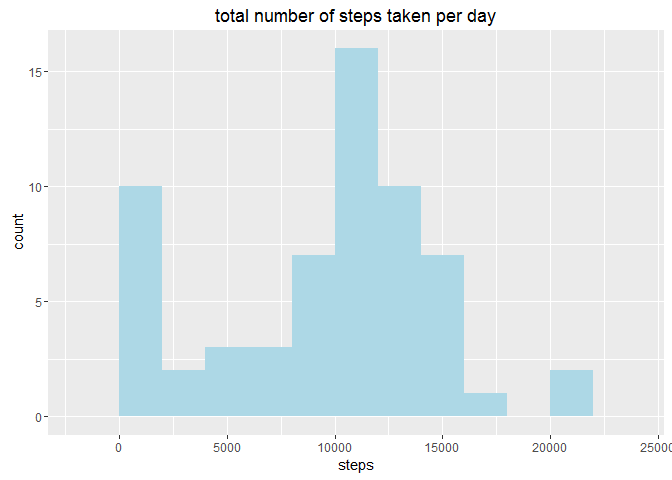
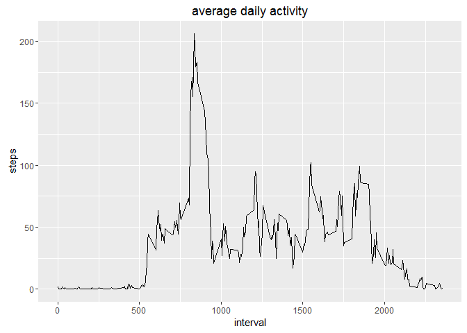
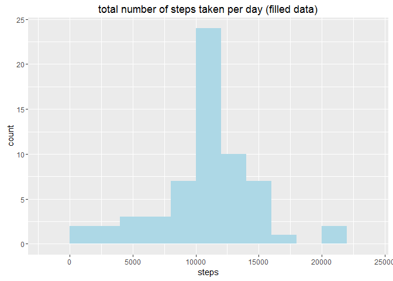

# Reproducible Research: Peer Assessment 1
Avner Freiberger  


## Loading and preprocessing the data

```r
library(ggplot2)

### read csv file
raw_data <- read.csv("activity.csv")
str(raw_data)
```

```
## 'data.frame':	17568 obs. of  3 variables:
##  $ steps   : int  NA NA NA NA NA NA NA NA NA NA ...
##  $ date    : Factor w/ 61 levels "2012-10-01","2012-10-02",..: 1 1 1 1 1 1 1 1 1 1 ...
##  $ interval: int  0 5 10 15 20 25 30 35 40 45 ...
```

```r
### clean all NAs using complete.cases
clean_data <- raw_data[complete.cases(raw_data),]
str(clean_data)
```

```
## 'data.frame':	15264 obs. of  3 variables:
##  $ steps   : int  0 0 0 0 0 0 0 0 0 0 ...
##  $ date    : Factor w/ 61 levels "2012-10-01","2012-10-02",..: 2 2 2 2 2 2 2 2 2 2 ...
##  $ interval: int  0 5 10 15 20 25 30 35 40 45 ...
```


## What is mean total number of steps taken per day?


```r
### Aggregate data into daily totals
daily_totals <- aggregate(raw_data$steps, by = list(raw_data$date), FUN = sum, na.rm=TRUE)
names(daily_totals) <- c("date", "steps")
ggplot(data = daily_totals, aes(x = steps))+ geom_histogram( binwidth = 2000,fill = "light blue") + ggtitle("total number of steps taken per day")
```



```r
###  calculate mean total daily steps:
mean(daily_totals$steps)
```

```
## [1] 9354.23
```

```r
### calculate median total daily steps:
median(daily_totals$steps)
```

```
## [1] 10395
```
## What is the average daily activity pattern?

```r
### aggregate the raw data by intervals
by_interval <- aggregate(raw_data$steps, by = list(raw_data$interval), FUN = mean,na.rm = TRUE)
names(by_interval) <- c("interval", "steps")

ggplot(data = by_interval, aes(x = interval, y = steps))+ geom_line() + ggtitle("average daily activity")
```



```r
###Which 5-minute interval, on average across all the days in the dataset,contains the maximum number of steps?
by_interval[which.max( by_interval[,2] ),]
```

```
##     interval    steps
## 104      835 206.1698
```
## Imputing missing values

```r
### number of missing values:
sum(is.na(raw_data$steps))
```

```
## [1] 2304
```

```r
### fill missing values by applying average of the same interval to the missing fields

merged <- merge(x= raw_data,y = by_interval,by = "interval")
merged[which(is.na(merged$steps.x)),"steps.x"] <- merged[which(is.na(merged$steps.x)),"steps.y"]
filled_data <- merged[,c("steps.x","date","interval")]
names(filled_data) <- names(raw_data)

### review the results
str(filled_data)
```

```
## 'data.frame':	17568 obs. of  3 variables:
##  $ steps   : num  1.72 0 0 0 0 ...
##  $ date    : Factor w/ 61 levels "2012-10-01","2012-10-02",..: 1 54 28 37 55 46 20 47 38 56 ...
##  $ interval: int  0 0 0 0 0 0 0 0 0 0 ...
```

```r
### Aggregate data into daily totals (filled data)
daily_totals_filled <- aggregate(filled_data$steps, by = list(filled_data$date), FUN = sum)
names(daily_totals_filled) <- c("date", "steps")
ggplot(data = daily_totals_filled, aes(x = steps))+ geom_histogram(binwidth = 2000,fill = "light blue") + ggtitle("total number of steps taken per day (filled data)")
```



```r
###  calculate mean total daily steps:
 mean(daily_totals_filled$steps)
```

```
## [1] 10766.19
```

```r
### calculate median total daily steps:
median(daily_totals_filled$steps)
```

```
## [1] 10766.19
```

```r
# comparing to the unclean data - The NA values appeared as zeros and caused both mean and median to become lower than they should
```
## Are there differences in activity patterns between weekdays and weekends?


```r
filled_data$Weekday <- weekdays(as.Date(filled_data$date))
filled_data$Weekday <- sub(x= filled_data$Weekday, pattern ="Saturday|Sunday",replacement = "weekend")
filled_data$Weekday <- sub(x= filled_data$Weekday, pattern ="Monday|Tuesday|Wednesday|Thursday|Friday",replacement = "weekday")

by_interval_filled <- aggregate(filled_data$steps, by = list(filled_data$interval, filled_data$Weekday), FUN = mean,na.rm = TRUE)
names(by_interval_filled) <- c("interval","weekday", "steps")
by_interval_filled$weekday <- as.factor(by_interval_filled$weekday)

ggplot(data = by_interval_filled, aes(x = interval, y= steps)) + geom_line() + facet_grid(weekday~.)
```


```r
 # there is a difference in the behavior between weekdays and weekends. On weekdays, there is high activity between 750-1000 intervals
```


